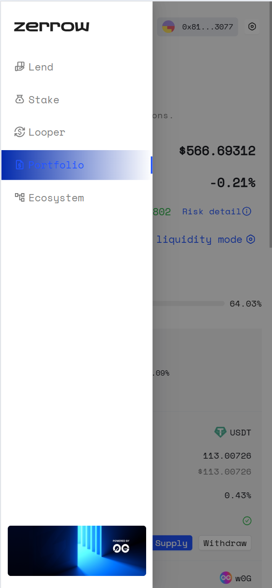
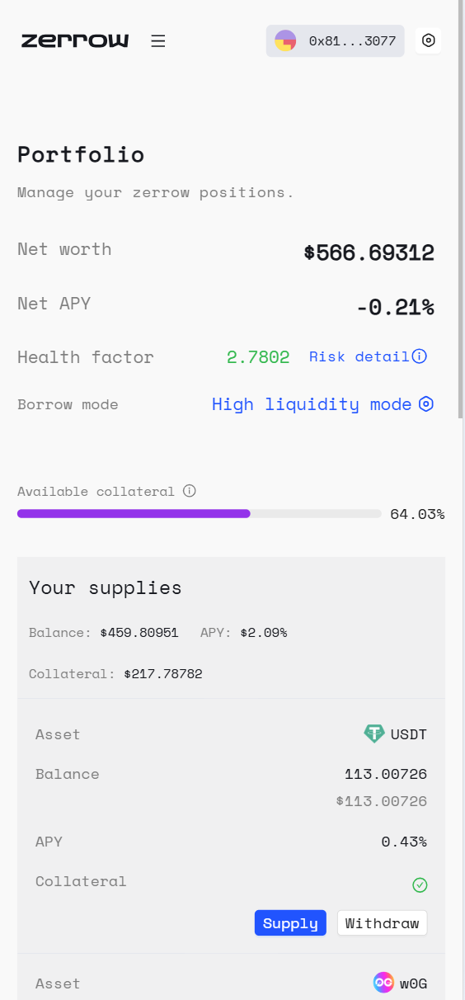

# Details of Three User Modes 

This protocol has three modes, namely: **High Liquidity mode, Risk Isolation mode, and Homologous mode**. (It is best to confirm the mode of each address before use, as this agreement ensures the security of protocol assets and cannot perform mode conversion after the address has assets.)
High liquidity mode can store all the most mainstream assets and lend out assets of all varieties;
Risk isolation mode allows you to deposit the selected risk asset variety and only lend out specified stablecoin assets, USDc。
This mode can store selected risk asset groups and can only lend out assets of any variety within the same group.
The following will demonstrate the operation of the relevant modes one by one:

Firstly, we need to enter the Portfolio page,We can click on the three horizontal bars in the upper left corner to display the protocol menu，and then click on the Portfolio button.

We can see a Portfolio page similar to the following：

## High Liquidity mode
The High Liquidity mode is the initial mode of all addresses. In this mode, you have the most available assets and the most extensive types of assets that can be stored.

## Risk Isolation mode
Risk Isolation mode is a mode of using high-risk assets. In this mode, you can only deposit the isolated assets selected when you set to this mode, and you can only lend specific stable currency assets(USDC). Each isolated asset has a total amount of asset lending, and when the total amount of stablecoins lent out using this isolated asset on the entire 0g network reaches this limit, borrowing cannot continue.

## Homologous mode
Homogous mode is similar to many lending protocol e-modes. In this mode, it is possible to use ultra-high collateral ratio to deposit and borrow a certain type of homogeneous asset, while the liquidation risk is relatively low.

