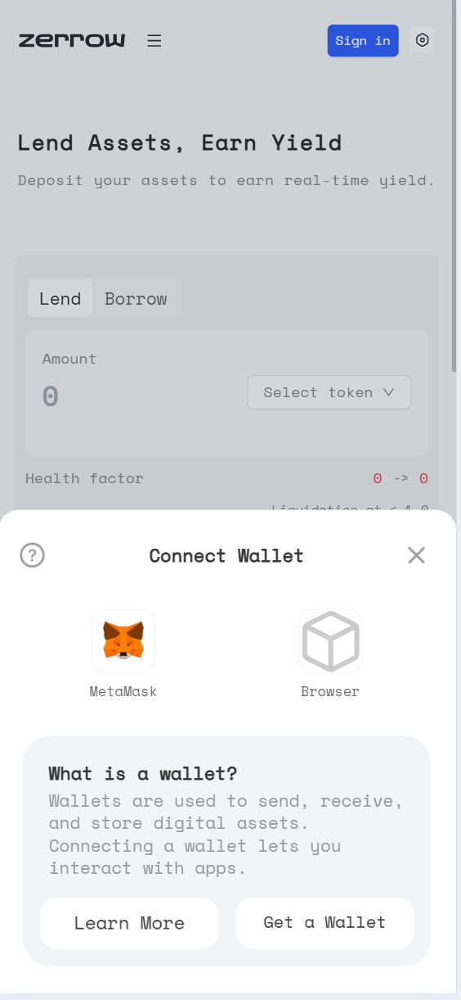
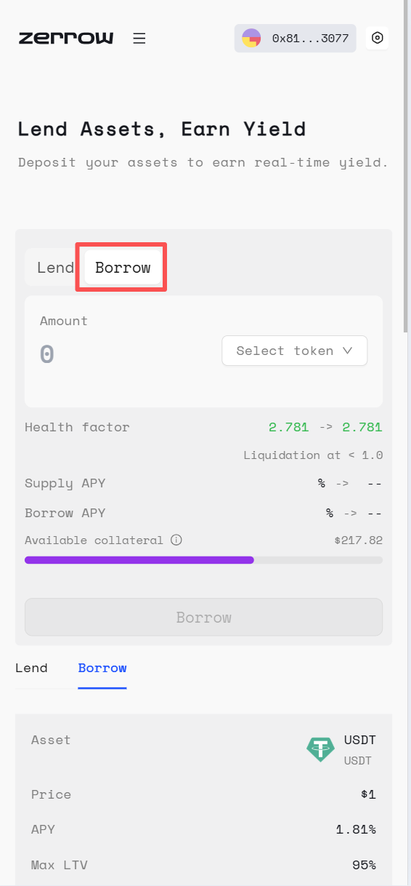
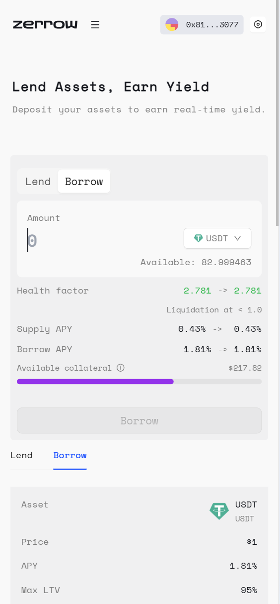

# How to Borrow On Zerrow

Zerrow is an overcollateralized protocol, meaning you must first lend assets to use as collateral before borrowing liquidity. This ensures that the loans are secure and minimizes risk for Lenders. Borrowing funds on zerrow incurs a fee called “borrowing interest,” which is expressed as an Annual Percentage Rate (APR). The more you borrow, the higher your interest rate will be. APRs for each asset can be found in zerrow web interfaces and protocol configurations.

There is no set time for repayments—you can borrow for any duration as long as your account remains “healthy.” If your account health falls below a certain threshold, your positions will be liquidated to repay the loan and protect the protocol.

How to Borrow On zerrow : Step by Step
Step 1. Go to the zerrow app and connect your wallet:

If you do not have a prior history with the zerrow protocol as a Lender, then you must first lend some liquidity before proceeding “Borrow”.

Step 2. Select “Borrow” in the Action Box and review the available liquidity pools of supported tokens. Then choose which asset you want to borrow:

Step 3. In the Action Box, specify the amount you want to borrow and then click “Borrow”:

The “Available Collateral” indicator shows the amount of collateral you have left after opening this borrow position. This available collateral can be used to open other borrow positions or to withdraw part of your collateral.

