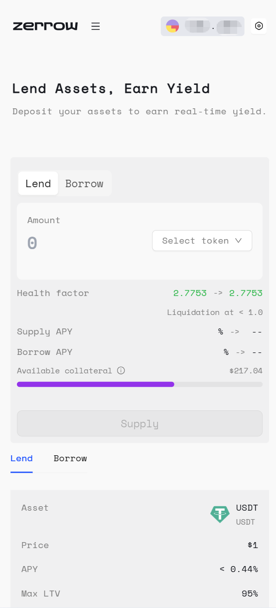

# How to Lend On Zerrow

In order to participate as a Lender on zerrow, follow these steps (all photos are taken on mobile views):

**Step 1.** Go to the zerrow app and click the button on the “Start earning”.

Then go to Dapp page, and click the button on the “Sign in”.

Proceed to sign in with any available sign in option. If you’re an experienced EVM user, feel free to sign in with any one of the supported wallets:

**Step 2.** On the Action Box, make sure you’re on the “Lend” option.

And proceed to select the asset you want to supply from zerrow’s list of supported tokens:

**Step 3.** Specify an amount and click “Supply” to deposit your tokens into an asset pool:

**Step 4.** Begin earning yield on your deposit:

Congratulations! if you followed along with the steps above, then you just successfully participated in the zerrow protocol. Immediately after providing liquidity, the Portfolio page will be updated with your Supply position.

**Step 5.** Withdrawing and/or depositing from your Supplied positions:
If you ever decide to withdraw from or add more to your Supplied positions, simply visit the Portfolio page.

Select the Supplied position you want to interact with and specify the amount you want to withdraw/supply. You can also reference the Portfolio page to track key metrics on your borrow and lend positions.

